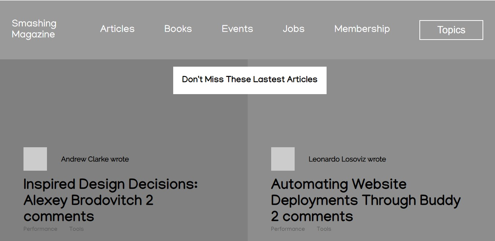

# Project Name
Smashing Magazine Design Teardown

## Table of contents
* [General info](#general-info)
* [Screenshots](#screenshots)
* [Technologies](#technologies)
* [Setup](#setup)
* [Features](#features)
* [Status](#status)
* [Contact](#contact)

## General info
In this project, our goal is to break apart the Smashing magazine website. This is to start training ourselves to think in terms of visual hierarchy, typography and design principles.
The purpose is to create a grayscale heat map of the <a href="https://www.smashingmagazine.com/">Smashing Magazine website</a> that indicates which elements have the greatest weight in the visual hierarchy. It is a collaborative effort by <a href="https://github.com/adaorachi">MaryAnn Chukwuka</a> and <a href="https://github.com/JayKowski"> Judah Maina </a>.

## Screenshots

View other screenshots:
<a href="images/screenshot2.jpg">Screenshot 1</a>

## Technologies
* HTML5
* CSS3

## Setup
This project is built with the basic web page structures and styling. It is pretty simple to setup. All you have to do is to clone the project into your local repository.
Find attached below a preview of the project:  
<a href="https://raw.githack.com/adaorachi/smashing-magazine/article-page/index.html">Smashing Magazine Design Teardown </a>

## Features
List of features ready and TODOs for future development
* We do not have any future or TODO development for now. We will definitely give out a notice should we decide to.

## Status
The project is currently finished.

## Contact
Created by [@MaryAnn Chukwuka](https://github.com/adaorachi) and [@Judah Maina](https://github.com/JayKowski) - feel free to contact us!
